<!-- color: "#6ac9ff" -->
<!-- backgroundColor: "#00293A" -->

<!-- _footer: '' -->
<!-- _backgroundColor: "#0033A0" -->

---

<!-- _footer: '' -->

*two decades of history, many more to come*

### Duarte Galvão, Michel Succar (CERN)

#### JACoW Team Meeting 2024

---

### 

 - **Event Management** System
 - **Collaborative effort** - MIT License
 - Core Developed at **CERN**
 - With contributions from the **United Nations**, **Max-Planck Institute for Physics** and many others!
 - **70+ developers** over the years

---

*The most popular event management system you never heard about*

&nbsp;
&nbsp;
&nbsp;
&nbsp;
&nbsp;

 - **300+ servers**
 - **> 350K users**
 - Initial growth in research, but growing beyond it
   - [indico.un.org](https://indico.un.org)
   - [events.canonical.org](https://events.canonical.com/)
   - [indico.gnome.org](https://indico.gnome.org)
   - [lpc.events](https://lpc.events)

---

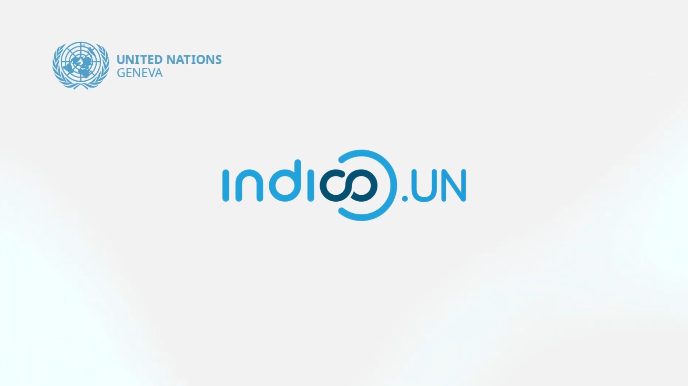
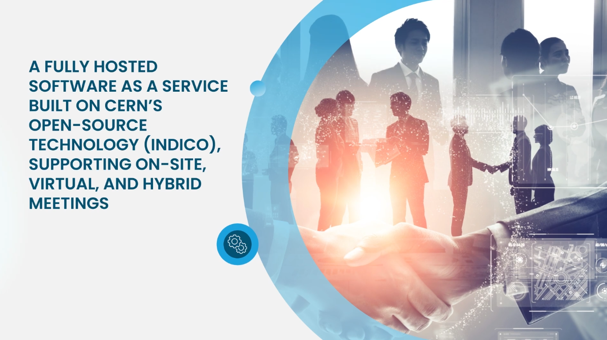 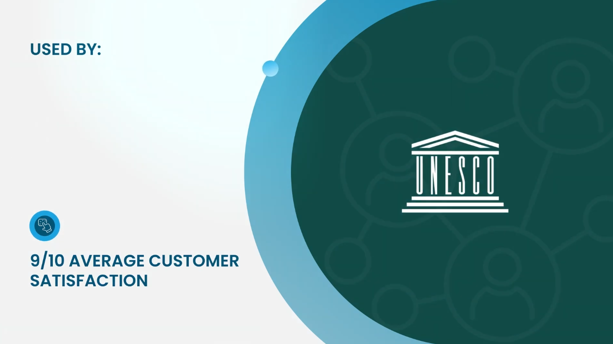

---

### History

 - **1999** - **CDS Agenda**
 - **2002** - **EU Project**
 - **2004** - Indico in **Production**
 - **2007** - **Room Booking**
 - **2008** - **Interface overhaul**
 - **2013** - First **Workshop**
 - **2015** - The **UN** starts using it
 - **2017** - Indico 2.0 (**rewrite**)
 - **2021** - Indico 3.0 (**Python 3**)
 - **2023** - **1 Million Events** surpassed at CERN 🎉
 - **2024** - **20 years!**

---

https://cordis.europa.eu/project/id/IST-2001-34306

---

### Team

 

---

### CERN

- **~17.000** people on campus <!-- 2022 stats -->
- **~230** meeting rooms
- **100.000+** events/year
  * **1.000.000+** events total
- (Distributed) Meetings
- Conferences, workshops

---

### Adoption at CERN

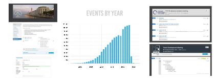

---

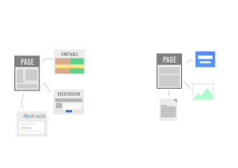

---

---

### Philosophy

 - "General purpose" **core**
 - Extension through **plugins** 🧩
 - **Themes** 🎨 (customization)

---

### Under the Hood

 - Python 3 🐍
 - PostgreSQL 🐘
 - Flask
 - Celery
 - SQLAlchemy
 - React
 - Semantic UI React
 - *among many others!*

---

### Extensions

 - Video conferencing 📹
 - Payment Systems 💰
 - Automatic conversion to PDF 🖨
 - Search 🔎
 - Storage 💾
 - URL Shortening 👉
 - Internal Workflows (e.g. recording, visitors)

---

### Zoom

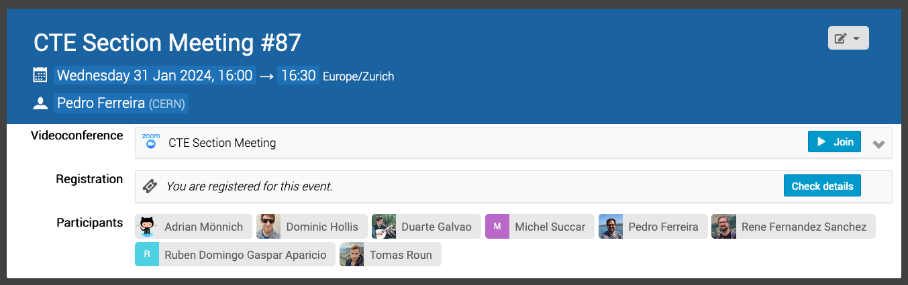

---

### Electronic Payment

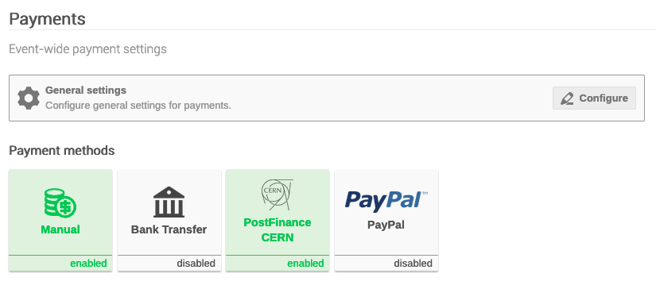

---

### Workflows

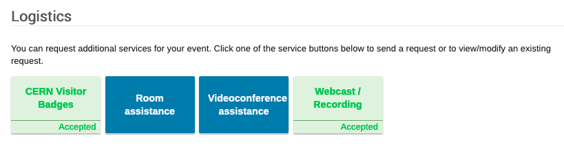

---

### Access Registration

---

### Recording of Events

---

### Hot desking

---

### Themes / Customization

---

### Themes / Customization

---

### Themes / Customization

---

### Check-in App (PWA)

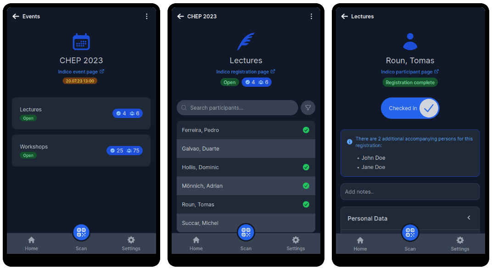

---

### How to get Indico?

 * 🏃🏻 **Option 1: run it yourself**
    - **Pros:** full control, data sovereignty/privacy, cheap (if you have internal IT know-how)
    - **Cons:** may become expensive if there is no know-how
 * 🖥️ **Option 2: get someone to run it on your own infrastructure**
    - **Pros:** full control, data sovereignty/privacy, cheap (if you have your own IT infrastructure)
    - **Cons:** you still need to have your own IT infrastructure
 * ☁️ **Option 3: get someone to host/run it for you (cloud)**
    - **Pros:** most likely cheaper than running your own IT
    - **Cons:** data sovereignty/privacy

---
### Some known providers
 - Mythic Beasts
 - S2Innovation
 - unconventional.dev (CERN spin-off)

---

### Governance
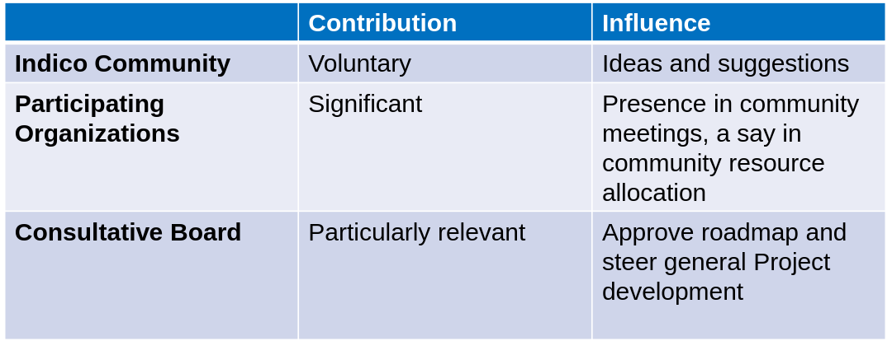

 - Clear **Governance Policy** with **roles and bodies**
 - Regular workshops and community events
 - **Consultative board:** CERN, UN and MPP
 - **"Making Indico better for us and everyone else"** e.g. accessibility work by UN
 
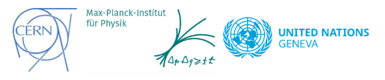
https://github.com/indico/governance

---

### What is JACoW?

---

<!-- _paginate: hold -->

### What is JACoW? (our POV)

---

<!-- _paginate: hold -->

### What is JACoW? (our POV)

---

### Past year's progress

- We went to IPAC24

---

### Past year's progress

- We went to IPAC24
    - and we took notes!

---

### Contributions permission

---

### UI/UX improvements

 

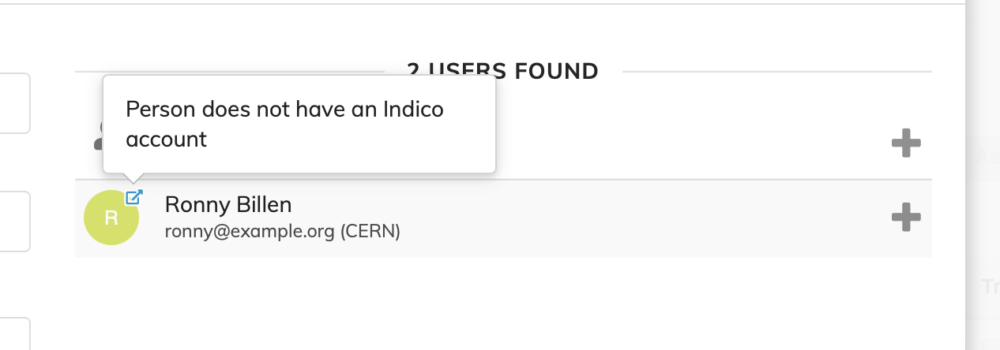

---

### Improvements on Reviewing

- Judge button on editing revisions
- Switching between actions on the editing timeline erases comment
- Green-dot with new files

 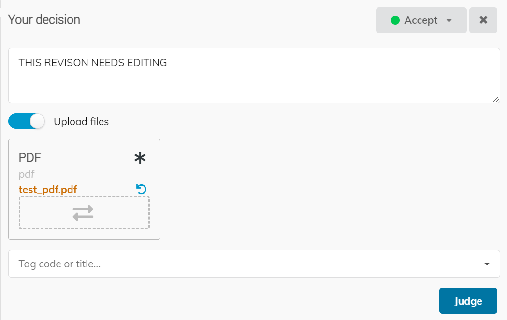

---

### More transparency on QA Fails

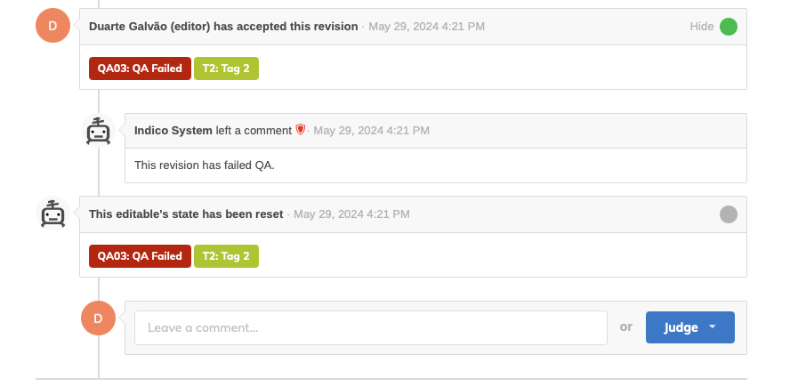

---

### Multiple affiliations

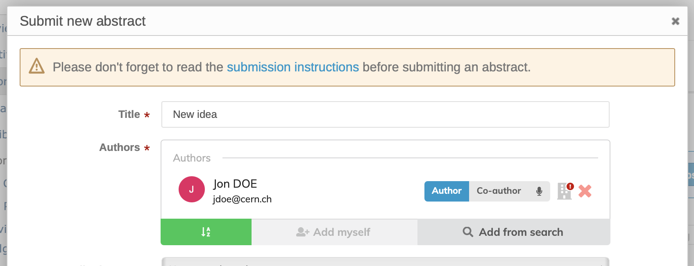 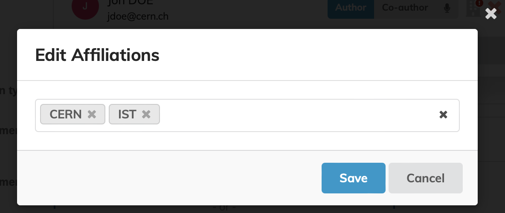
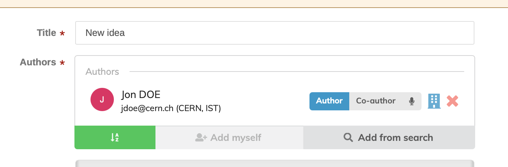

---

### The Future of Indico

- Greater Accessibility (a11y) 
- UI Improvements and legacy code removal
    - React-based timetable
- User Interfaces
    - Improvements in material editor (e.g. better drag and drop)
    - Responsive interfaces that work OK on mobile
- More user-centric home page
- Version 2 of the REST API: granular scopes, endpoint versioning, OpenAPI support;
- More info in our roadmap (https://getindico.io/roadmap/)

---

<!-- _footer: '' -->

### Come to our workshop!

*Date TBA; sometime in March*

&nbsp;
&nbsp;
&nbsp;
&nbsp;
&nbsp;
&nbsp;
&nbsp;
&nbsp;
&nbsp;
&nbsp;

---

### [getindico.io](https://getindico.io)

 [@getindico@fosstodon.org](https://fosstodon.org/@getindico)
 [@getindico](https://twitter.com/getindico)
 [@#indico:matrix.org](https://app.element.io/#/room/#indico:matrix.org) / indico@libera.chat

---

<!-- _footer: '' -->
<!-- _paginate: false -->

