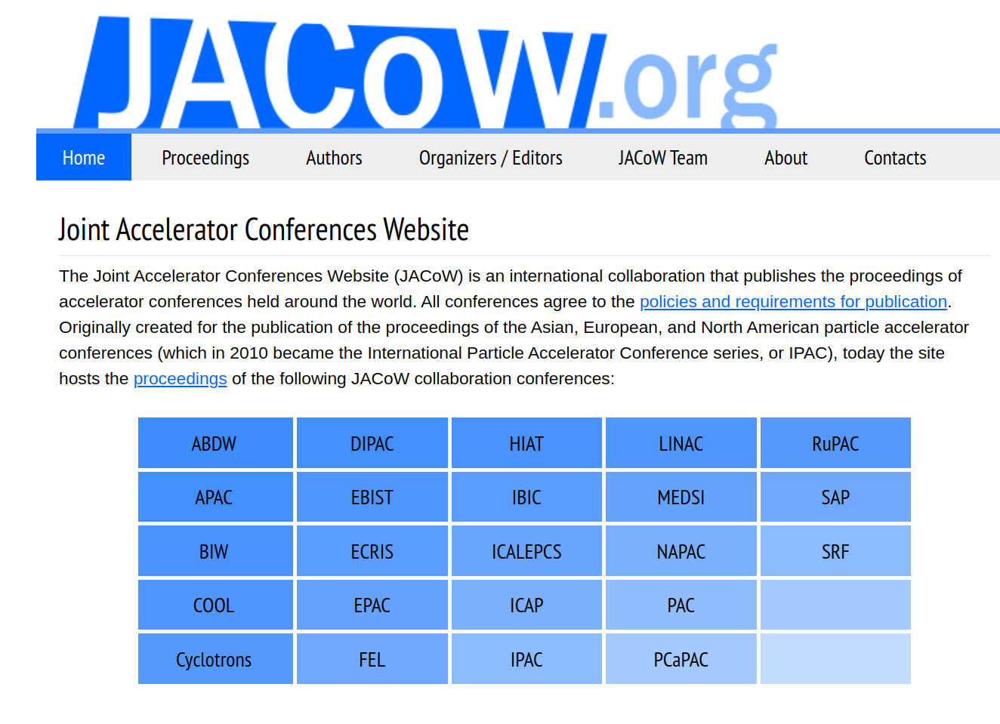
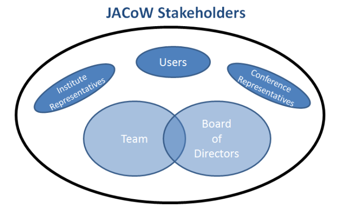
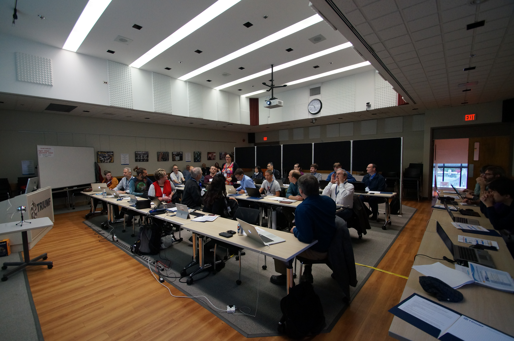
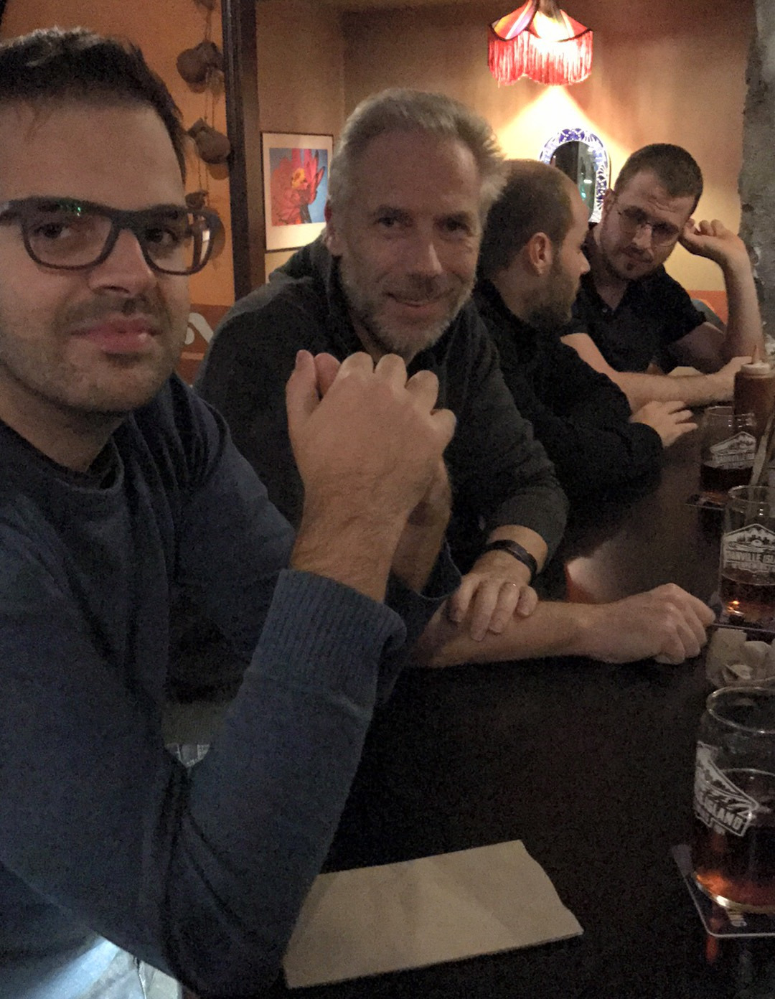
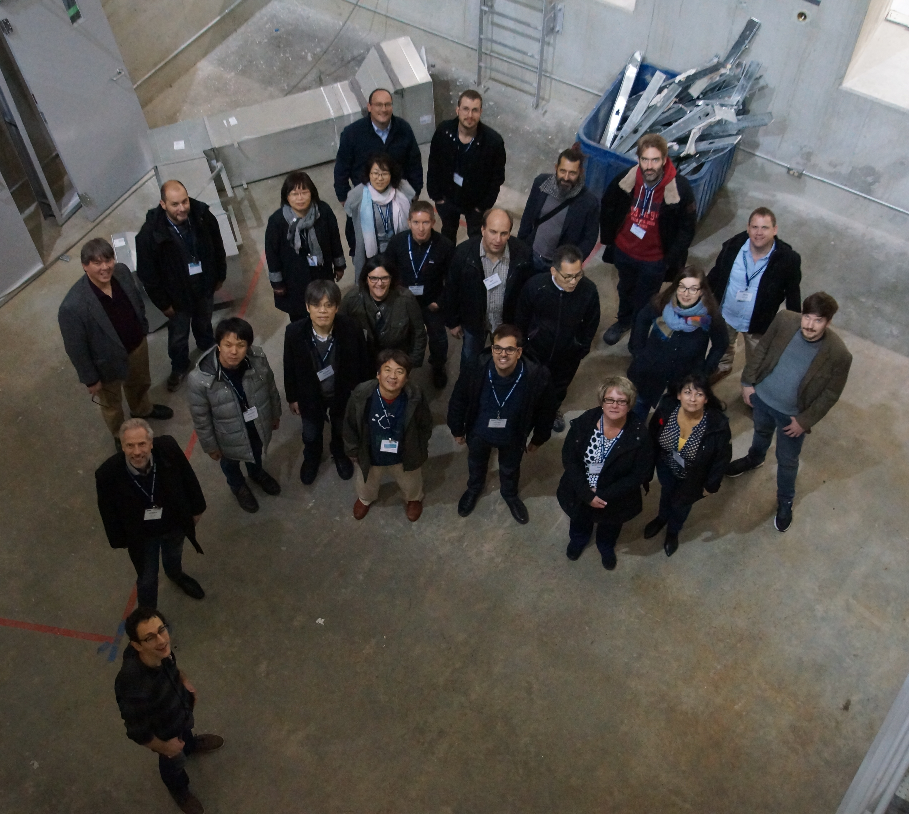

<!-- color: "#6ac9ff" -->
<!-- backgroundColor: "#00293A" -->

<!-- _footer: '' -->
<!-- _backgroundColor: "#0033A0" -->

---

<!-- _footer: '' -->

*8 years of Indico-JACoW collaboration*

### Duarte Galvão (IT-CA-CTE)

#### IT-CA Group Meeting *(December 2024)*

---

### Team

---
<!-- _paginate: hold -->

### Team

---

### What is a "JACoW"?

---
<!-- _backgroundColor: "#FFFFFF" -->

---

### What is JACoW?

- JACoW is NOT a legal entity
- Members from research institutions from all over the world
- Oversees and provides services for publication of conference proceedings

---

### What is JACoW? (Institutions)

#### Americas
- BNL (Upton, NY, US)
- Cornell University (CLASSE) (Ithaca, NY, US)
- FRIB (East Lansing, MI, US)
- JLAB (Newport News, VA, US)
- LANL (Los Alamos, NM, US)
- LBNL (Berkeley, CA, US)
- LNLS (Campinas, BR)
- ORNL (Oak Ridge, TN, US)
- SLAC (Menlo Park, CA, US)
- TRIUMF (Vancouver, BC, CA)

#### Asia-Pacific
- ANSTO (Sidney, AU)
- BARC (Mumbai, IN)
- CIAE (Beijing, CN)
- HU/AdSM (Higashi-Hiroshima, JP)
- IBS (Daejeon, KR)
- IHEP (Beijing, CN)
- IMP (Lanzhou, CN)
- JAEA/J-PARC (Tokai-mura, JP)
- KAERI (Daejeon, KR)
- KBSI (Busan, KR)
- KEK (Ibaraki, JP)
- KIRAMS/KHIMA (Seoul, KR)
- NIRS (Chiba, JP)
- NSRRC (Hsinchu, TW)
- PKU (Beijing, CN)
- RIKEN SPring-8 Center (Hyogo, JP)
- RRCAT (Indore, IN)
- SLRI (Nakhon Ratchasima, TH)
- SINAP (Shanghai, CN)
- TUB (Beijing, CN)
- VECC (Kolkata, IN)

#### Europe, Middle East, Africa
- CELLS-ALBA Synchrotron (Barcelona, ES)
- **CERN (Geneva, CH)**
- CEA/DSM/IRFU (Orsay, FR)
- DESY (Hamburg, DE)
- DLS (Oxford, GB)
- Elettra-Sincrotrone Trieste (Trieste, IT)
- ESRF (Grenoble, FR)
- ESS (Lund, SE)
- GSI (Darmstadt, DE)
- HZB (Berlin, DE)
- HZDR (Dresden, DE)
- IAP/RAS (Nizhny Novgorod, RU)
- IFIC (Valencia, ES)
- INFN/LNF (Frascati, IT)
- ILSF (Tehran, IR)
- KIT (Karlsruhe, DE)
- KACST (Riyadh, SA)
- MAX-lab (Lund, SE)
- PSI (Villigen, CH)
- STFC/DL/ASTeC (Daresbury, GB)
- STFC/RAL/ASTeC (Didcot, GB)
- The University of Liverpool (Liverpool, GB)
- URLS (Rome, IT)

---

### What is JACoW? (People)

| Role                                         | Person                                         |
|----------------------------------------------|------------------------------------------------|
| **Chair**                                    | Adriana Rossi, CERN / 2024-2027                |
| **Deputy Chair**                             | Caitlin Hoffman, BNL / 2023-2026               |
| **Coordinator**                              | Jana Thomson, TRIUMF / 2024-2027               |
| **Directors**                                | Thakonwat Chanwattana, SLRI / 2022-2025 Johan Olander, ESS / 2022-2025 Volker Schaa, GSI / 2022-2025 |
| **Regional Support Manager for Asia-Pacific**| Takashi Kosuge, KEK (SPMS)                     |
| **Regional Support Manager for EMEA**        | Ronny Billen, CERN (SPMS) Jan Chrin, PSI (fileserver) |
| **JACoW-Indico Manager**                     | Ivan Andrian, Elettra Sincrotrone Trieste       |
| **Repository Manager**                       | Magdalena Montes-Loera, SLAC Volker RW Schaa, GSI |

| Role                                         | Name, Affiliation and Dates                    |
|----------------------------------------------|------------------------------------------------|
| **JACoW.org Webmaster**                      | Stefano Deiuri, Elettra Sincrotrone Trieste     |
| **JACoW.org Content Manager**                | Sumner Brown Gibbs, ORNL                       |
| **Proceedings Maintenance**                  | Europe: Ronny Billen, CERN Asia: Kazuro Furukawa, KEK                     |
| **Indico Support and Development**           | Adrian Mönnich, CERN Duarte Galvão, CERN Michel Succar Medina, CERN                     |
| **Co-Opted Team Members**                    | Evelyne Akers, Jefferson Lab Lin Bian, IHEP Beijing David Button, ANSTO Zhichu (Ross) Chen, SARI Stefano Deiuri, Elettra Sincrotrone Trieste Michaela Marx, DESY Meghan McAteer, HZB Vincent Mitts, CAMD/LSU Raphael Mueller, GSI Josh Peters, ANSTO Alumnus Christine Petit-Jean-Genaz, CERN Contributing Retiree John Poole, JP Scientific/CERN Akihiro Shirakawa, KEK Heping Yan, SINAP                              |

---

---

### What is JACoW? (Conferences)

- **IPAC** from 2010 (formerly PAC, EPAC, APAC)
- **NA-PAC** from 2011 (formerly PAC)
- **IBIC** from 2012 (European DIPAC and North-American
BIW)
- **COOL, CYCLOTRONS, ECRIS, EIC, FEL, HIAT, ICAP, ICALEPCS, ICFA ABDW, LINAC, MEDSI, PCaPAC, RUPAC, SAP, SRF**

---

# 2000s

---

### SPMS

- "Scientific Programme Management System"
- Developed by FNAL for JACoW in the early 2000s
- Allowed the handling of users, affiliations, mailing lists, editing conference procceedings, etc.

---

### SPMS (the downfall)

- Became unmaintainable by the early 2010s
- Constant security issues
- Currently hosted at CERN

---

# 2013

---

### A collaboration is born

- First participation of Indico members in JACoW Team Meeting in December 2013
- First draft for the Indico-JACoW project plan by Thomas Baron in December 2015
- In hindsight: vastly underestimates the work needed

---

### First kick-off

- A 132-page specification was drafted in April 2016
- Very detailed action items
- Estimated 4 years worth of work in total

---

*JTM'16, Vancouver, Canada*

---

### But, there was a problem...

---

### The solution?

* ##  WORKING TOGETHER 

---

###  Working together 

- In 2019, after it was first tested by JACoW members, it wasn't ready to run any conference
- In 2021, Ivan Andrian (Elettra Sincrotrone Trieste) was designated as the JACoW-Indico Manager
- Since then, we've regular meetings to keep up with the project's status
- Started using a Kanban board

---

###  Working together 

- In August 2022 JACoW ran its first large conference (fully) on Indico

- Since 2023, there have been no more conferences run on SPMS

---

###  Working together 

- In the past couple of years, we've had a much closer collaboration

*JTM'23, Hsinchu, Taiwan*

*IPAC'24, Nashville, TN, USA*

---

# 2024

---
<!-- _backgroundColor: "#FFFFFF" -->

---

### Our approach to JACoW requests

- Useful for the entire community
    &rarr; Indico Core
- Mostly for the JACoW community, but still quite general
    &rarr; Indico Core, as a setting
- Specific to JACoW use cases
    - highly linked to Indico
        &rarr; JACoW Plugin or Microservice
    - loosely related to Indico
        &rarr; JACoW's problem ;)

---

### What is JACoW? (our POV)

---
<!-- _paginate: hold -->

### What is JACoW? (our POV)

---

### Past year's progress

- We went to IPAC24

---
<!-- _paginate: hold -->

### Past year's progress

- We went to IPAC24
    - and we took notes!
    - https://cern.ch/ipac24notes

---

### Contributions ACL permission

---

### Revision files upload errors

 

---

### Refactor ReviewForm

- Judge button on editing revisions
- Switching between actions on the editing timeline erases comment

---

### Upload files on "Approve" judgment

---

### Future of the Indico-JACoW Collaboration

- (Finish) implementing feedback from IPAC24
- Abandon SPMS/Central Repository and use Indico as the sole source of identities
    - Ability to add authors manually after search result returns empty
    - Integration with new mailing list service
    - Implement custom fields for user profiles
    - Add ORCID & ROR integration with user profiles
- UI/UX improvements in Contributions/Abstracts management

---
<!-- _footer: '' -->
<!-- _paginate: false -->

