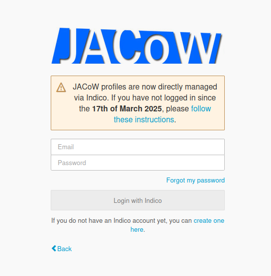
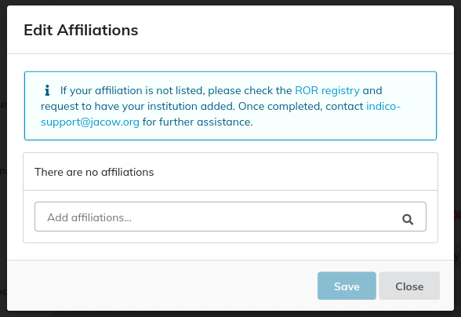
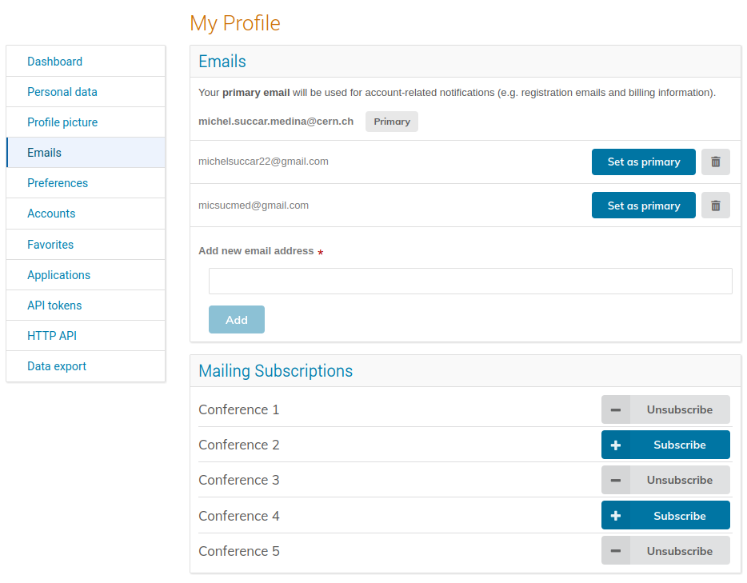
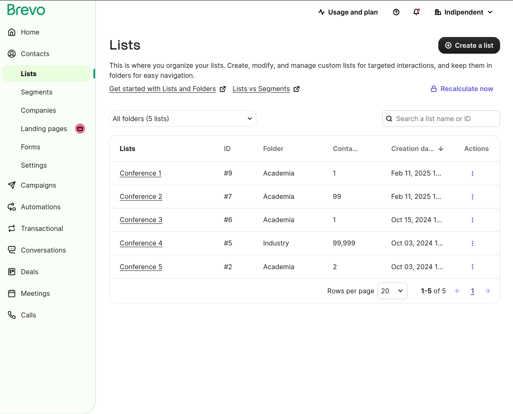

<!-- color: "#6ac9ff" -->
<!-- backgroundColor: "#00293A" -->

<!-- _footer: '' -->
<!-- _backgroundColor: "#0033A0" -->

---

<!-- _footer: '' -->

*Indico-JACoW Collaboration*

### Michel Succar - IT-CA-CTE (CERN)

#### BoD Meeting *(25th March 2025)*

---

### Removed the usage of Username entirely when logging in

---

### Multiple Affiliations

  

    <ul>
      <li>Affiliation selection when submitting will now only allow selecting institutions from the <a href="https://ror.org/">ROR repository</a></li>
      <ul>
        <li>For requesting the addition of new institutions a <a href="https://ror.org/registry/">submission to ROR</a> is needed</li>
        <li>Nicolas Delerue reported some missing fields related to affiliations when selecting institutions (e.g. country code)</li>
      </ul>
    </ul>
  

  

    
  

---

### Integration with new mailing list service (Brevo) 🚧

 

---

### Login-in issues

- Minor complications during Sunday night and Monday morning with some logging that has already been solved
- Reported errors on multiple requests for password reset (Most likely a User side error)

---
<!-- _footer: 'Pictured: me presenting to all of the active SPMS developers @ Music City Center, Nashville, TN, USA' -->
<!-- _paginate: false -->

