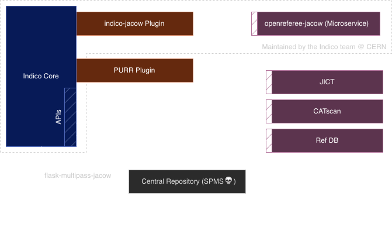

<!-- color: "#6ac9ff" -->
<!-- backgroundColor: "#00293A" -->

<!-- _footer: '' -->
<!-- _backgroundColor: "#0033A0" -->

---

<!-- _footer: '' -->

*how's it going? when are we dumping SPMS?*

### Duarte Galvão, Michel Succar (CERN)

#### JACoW Team Meeting 2024

---

### Adoption at CERN

---

*The most popular event management system you never heard about*

&nbsp;
&nbsp;
&nbsp;
&nbsp;
&nbsp;

 - **300+ servers**
 - **> 350K users**
 - Initial growth in research, but growing beyond it
   - [indico.un.org](https://indico.un.org)
   - [events.canonical.org](https://events.canonical.com/)
   - [indico.gnome.org](https://indico.gnome.org)
   - [lpc.events](https://lpc.events)

---

### Team

 

---

### Extensions

 - Video conferencing 📹
 - Payment Systems 💰
 - Automatic conversion to PDF 🖨
 - Search 🔎
 - Storage 💾
 - URL Shortening 👉
 - Internal Workflows (e.g. recording, visitors)

---

### Zoom

---

### Electronic Payment

---

### Workflows

---

### Access Registration

---

### Recording of Events

---

### Check-in App (PWA)

---

### Governance

 - Clear **Governance Policy** with **roles and bodies**
 - Regular workshops and community events
 - **Consultative board:** CERN, UN and MPP
 - **"Making Indico better for us and everyone else"** e.g. accessibility work by UN
 

https://github.com/indico/governance

---

### What is JACoW?

---

<!-- _paginate: hold -->

### What is JACoW? (our POV)

---

<!-- _paginate: hold -->

### What is JACoW? (our POV)

---

### Past year's progress

- We went to IPAC24

---

### Past year's progress

- We went to IPAC24
    - and we took notes!

---

### Contributions ACL permission

---

### "Go to timeline" button

---

### Revision files upload errors

 

---

### Refactor ReviewForm

- Judge button on editing revisions
- Switching between actions on the editing timeline erases comment

---

### Upload files on "Approve" judgment

---

### More transparency with timeline resets

---

### The Future of Indico

- Greater Accessibility (a11y) 
- UI Improvements and legacy code removal
    - React-based timetable
- User Interfaces
    - Improvements in material editor (e.g. better drag and drop)
    - Responsive interfaces that work OK on mobile
- More user-centric home page
- Version 2 of the REST API: granular scopes, endpoint versioning, OpenAPI support;
- More info in our roadmap (https://getindico.io/roadmap/)

---

### [getindico.io](https://getindico.io)

 [@getindico@fosstodon.org](https://fosstodon.org/@getindico)
 [@getindico](https://twitter.com/getindico)
 [@#indico:matrix.org](https://app.element.io/#/room/#indico:matrix.org) / indico@libera.chat

---

<!-- _footer: '' -->
<!-- _paginate: false -->

