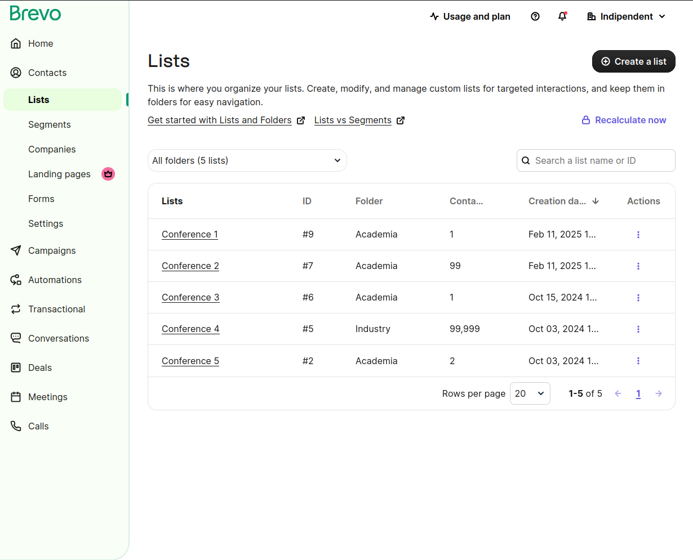

<!-- color: "#6ac9ff" -->
<!-- backgroundColor: "#00293A" -->

<!-- _footer: '' -->
<!-- _backgroundColor: "#0033A0" -->

---

<!-- _footer: '' -->

*Indico-JACoW Collaboration*

### Duarte Galvão, Michel Succar - IT-CA-CTE (CERN)

#### ATS Seminar *(13th February 2025)*

---

### 

 - **Event Management** System
 - **Collaborative effort** - MIT License
 - Core Developed at **CERN**
 - With contributions from the **United Nations**, **Max-Planck Institute for Physics** and many others!
 - **70+ developers** over the years

---

*The most popular event management system you never heard about*

&nbsp;
&nbsp;
&nbsp;
&nbsp;
&nbsp;

 - **300+ servers**
 - **> 350K users**
 - Initial growth in research, but growing beyond it
   - [indico.un.org](https://indico.un.org)
   - [events.canonical.org](https://events.canonical.com/)
   - [indico.gnome.org](https://indico.gnome.org)
   - [lpc.events](https://lpc.events)

---
<!-- _footer: '' -->

---
<!-- _footer: '' -->

---
<!-- _footer: '' -->

---
<!-- _footer: '' -->

---
<!-- _footer: '' -->

---
<!-- _footer: '' -->

---

### History

 - **1999** - **CDS Agenda**
 - **2002** - **EU Project**
 - **2004** - Indico in **Production**
 - **2007** - **Room Booking**
 - **2008** - **Interface overhaul**
 - **2013** - First **Workshop**
 - **2015** - The **UN** starts using it
 - **2017** - Indico 2.0 (**rewrite**)
 - **2021** - Indico 3.0 (**Python 3**)
 - **2023** - **1 Million Events** surpassed at CERN 🎉
 - **2024** - **20 years!**

---

https://cordis.europa.eu/project/id/IST-2001-34306

---

### Team

---
<!-- _paginate: hold -->

### Team

---

### The history of the Indico-JACoW Collaboration
* # 2000s

---

### SPMS

- "Scientific Programme Management System"
- Developed by FNAL for JACoW in the early 2000s
- Allowed the handling of users, affiliations, mailing lists, editing conference procceedings, etc.
- It's basically an oracle database using SQL to generate HTML 

---

### SPMS (the downfall)

- Became unmaintainable by the early 2010s
- Constant security issues
- Currently hosted at CERN

---

# 2013

---

### A collaboration is born

- First participation of Indico members in JACoW Team Meeting in December 2013
- First draft for the Indico-JACoW project plan by Thomas Baron in December 2015
- In hindsight: vastly underestimates the work needed

---

### First kick-off

- A 132-page specification was drafted in April 2016
- Very detailed action items
- Estimated 4 years worth of work in total

---

### But, there was a problem...

---

### The solution?

* ##  WORKING TOGETHER 

---

###  Working together 

- In 2019, after it was first tested by JACoW members, it wasn't ready to run any conference
- In 2021, Ivan Andrian (Elettra Sincrotrone Trieste) was designated as the JACoW-Indico Manager
- Since then, we've regular meetings to keep up with the project's status
- Started using a Kanban board

---

###  Working together 

- In August 2022 JACoW ran its first large conference (fully) on Indico

- Since 2023, there have been no more conferences run on SPMS

---

###  Working together 

- In the past couple of years, we've had a much closer collaboration

*JTM'23, Hsinchu, Taiwan*

*IPAC'24, Nashville, TN, USA*

---
<!-- _footer: '' -->

---

# 2025

---
<!-- _backgroundColor: "#FFFFFF" -->

---

### Our approach to JACoW requests

- Useful for the entire community
    &rarr; Indico Core
- Mostly for the JACoW community, but still quite general
    &rarr; Indico Core, as a setting
- Specific to JACoW use cases
    - highly linked to Indico
        &rarr; JACoW Plugin or Microservice
    - loosely related to Indico
        &rarr; JACoW's problem ;)

---

### What is JACoW? (our POV)

---
<!-- _paginate: hold -->

### What is JACoW? (our POV)

---

### Past year's progress

- We went to IPAC24

---
<!-- _paginate: hold -->

### Past year's progress

- We went to IPAC24
    - and we took notes!
    - https://cern.ch/ipac24notes

---

### Contributions ACL permission

---

### Revision files upload errors

 

---

### Refactor ReviewForm

- Judge button on editing revisions
- Switching between actions on the editing timeline erases comment

---

### Upload files on "Approve" judgment

---

### Multiple Affiliations

 

---

### Adding authors after search

 

---

### CSV import/export for Peer Review teams

 

---

### Future of the Indico-JACoW Collaboration

- (Finish) implementing feedback from IPAC24
- Abandon SPMS/Central Repository and use Indico as the sole source of identities
    - Integration with new mailing list service
    - Implement custom fields for user profiles
    - Add ORCID & ROR integration with user profiles
- UI/UX improvements in Contributions/Abstracts management
- https://github.com/orgs/indico/projects/2/views/4

---

### Integration with new mailing list service (Brevo) 🚧

 

---
<!-- _footer: 'Pictured: me presenting to all of the active SPMS developers @ Music City Center, Nashville, TN, USA' -->
<!-- _paginate: false -->

---
<!-- _backgroundColor: '#FFFFFF' -->

### Bonus slide: JACoW Editing Workflow

